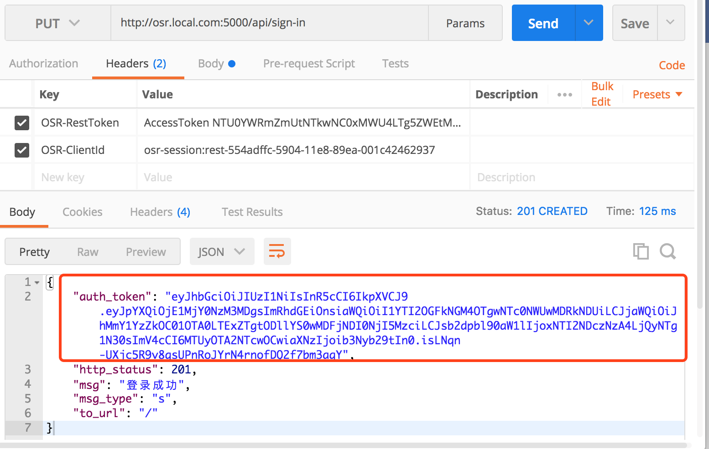

### Api请求验证
> Api请求验证分2种情况
 <br/>

- 情况1: 前端html等文件是经过OSROOM系统渲染, 响应回来的页面.
    因为html经过了OSROOM服务器Jinjia2模板引擎渲染, 带上了随机生成的csrf_token
    所以在html能获取到csrf_token, 具体使用如下教程
<br/>
<br/>
- 情况2.客户端为APP或小程序, 或者说html等静态文件不经过OSROOM, 独立隔离.
    这时候就要使用JWT方式验证, 具体如下教程
<br/>
<br/>
### CsrfToken验证
#### &nbsp;&nbsp;获取与使用CsrfToken
> 每个经过OSROOM后端的html页面都会带上一个CsrfToken, 具体使用方式如下
<br/>

- 使用Jinjia2语法获取
<br/>
```js
{{csrf_token()}}
```
<br/>
<br/>

- 每一个Api的请求都需要带上CsrfToken, 作为验证令牌.
   所以可以在html**&lt;head&gt;**与**&lt;head/&gt;**间写入如下代码

```js
<script type="text/javascript">
    //设置csrf token, 否则无法请求api数据(保证请求数据的网页是自己服务器的网页)
    var csrftoken = "{{ csrf_token() }}" //获取token
    $.ajaxSetup({
        beforeSend: function(xhr) {
            // 头部带上参数X-CSRFToken, 值为上面通过JinJia2获取到的csrftoken
            xhr.setRequestHeader("X-CSRFToken", csrftoken);
        }
    });
</script>

```
<br/>

- 浏览器F12可以看到我们写入的代码中的CSRFToken, 如图

<br/>


<br/>
<br/>
<br/>

### JWT验证(Token)

#### &nbsp;&nbsp;使用说明
- **SecretToken**与**AccessToken**用于在无**CsrfToken**时, 调用API请求的一个客户端令牌,
 以验证客户端是否为伪造的.
 <br/>
  <br/>
- SecretToken是长期可用验证令牌(除非你停用或者删除了它), 需要保存在客户端使用, 主要用于获取**AccessToken**.
 <br/>
  <br/>
- 使用令牌时, 可以使用SecretToken做令牌或者OSR-ClientId与AccessToken组合做令牌(见使用方式).
<br/>
 <br/>
- 为了减少SecretToken的暴露风险, 发送Api请求时, 尽量使用**OSR-ClientId**和**AccessToken**组合作为客户端验证令牌.
<br/>
 <br/>
- 当没有获取过AccessToken或者AccessToken失效时, 请通过**/api/token/access-token**获取新的AccessToken
    (具体请查看/api/token/access-token文档).
<br/>
 <br/>
- 获取AccessToken时, 只能使用SecretToken作为客户端令牌验证.(建议使用https)
```shell
  在http请求中设置请求头
  OSR-RestToken:"SecretToken xxxxx"
  或
  OSR-RestToken:"AccessToken xxxxx" 和 OSR-ClientId:"xxxxx"
```
<br/>
<br/>
 <br/>
#### &nbsp;&nbsp;获取AccessToken
> 第一次获取**AccessToke**n, 首先去OSROOM管理端获取**SecretToken**, 如图


<br/>
<br/>
> 然后GET请求**/api/token/access-token**获取一个新的AccessToken

- 请求时headers参数OSR-RestToken值为**SecretToken**为客户端令牌, 如图.
<br/>
<br/>
- 结果返回AccessToken和CliendId

<br/>
<br/>
- 如果请求**/api/token/access-token**的时候, 有带上**OSR-CliendId**, 则系统不会生成新的CliendId
  如下图, 结果返回的CliendId和请求时带上的一样

<br/>
<br/>
<br/>
#### &nbsp;&nbsp;请求API获取&修改数据
> 对于不需要登录验证的请求验证如下:
<br/>

- headers参数OSR-RestToken值为**AccessToken**和参数OSR-CliendId值为**CliendId**
<br/>
   
<br/>
<br/>
<br/>

#### &nbsp;&nbsp;登录获取BearerToken
> 请求Api(/api/sign-in)获取**BearerToken**
<br/>

- 如下图,登录时也headers页需要**AccessToken**和**CliendId**作为客户端令牌
<br/><br/>
headers参数OSR-RestToken值为**AccessToken**和参数OSR-CliendId值为**CliendId**
<br/><br/>

<br/><br/>
**注意**: 该请求还得带上Api请求参数username, password, use_jwt_auth

<br/><br/>
**客户端保存好获取到的auth_token(也就是下面要用到的BearerToken)**
<br/><br/><br/>
> 对于需要登录验证的API请求如下**
<br/>

- 和上面差不多, 也就多了一个headers参数**OSR-BearerToken**, 值为登录成功时获取的auth_token
<br/>

<br/>
<br/>
<br/>
#### &nbsp;&nbsp;注销登录
> 注销登录如下, 注销后前面所请求的AccessToken 和 BearerToken将失效
<br/>


